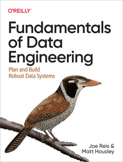

# Reading Group: Practical MLOps

MLOpsCommunity's reading group for [_Fundamentals of Data Engineering_](https://www.oreilly.com/library/view/fundamentals-of-data/9781098108298/) by Joe Reis and Matt Housley

# Book Description 

(From [O'Reilly site](https://www.oreilly.com/library/view/fundamentals-of-data/9781098108298/)) 

Data engineering has grown rapidly in the past decade, leaving many software engineers, data scientists, and analysts looking for a comprehensive view of this practice. With this practical book, you'll learn how to plan and build systems to serve the needs of your organization and customers by evaluating the best technologies available through the framework of the data engineering lifecycle.

Authors Joe Reis and Matt Housley walk you through the data engineering lifecycle and show you how to stitch together a variety of cloud technologies to serve the needs of downstream data consumers. You'll understand how to apply the concepts of data generation, ingestion, orchestration, transformation, storage, and governance that are critical in any data environment regardless of the underlying technology.

This book will help you:

Get a concise overview of the entire data engineering landscape
Assess data engineering problems using an end-to-end framework of best practices
Cut through marketing hype when choosing data technologies, architecture, and processes
Use the data engineering lifecycle to design and build a robust architecture
Incorporate data governance and security across the data engineering lifecycle

# Format

This is an async first reading club:

- Don't push yourself to read the entire book, select a few chapters (5 or 6) that you are really interested about
- There's no hurry, but working through a chapter per week is a good pace
- On the discussions tab, you will find a discussion for each chapter
- Each chapter discussion serves as free forum: add questions, thoughts, ideas
- Once you have completed the chapter, leave a comment with your learnings
- If you want to share code, feel free to create a repository and add share the files you want to discuss to the chapter discussion
- Sync conversations are still useful and fun! Ping us on #reading-group to see if we can schedule one!

# Chapter Discussions

1. [Data Engineering Described](https://github.com/mlopscommunity/Reading-Group-Practical-MLOps/discussions/15)

Questions? Reach us out at the #reading-group channel on [MLops Community](https://mlops.community/), or open an issue here

